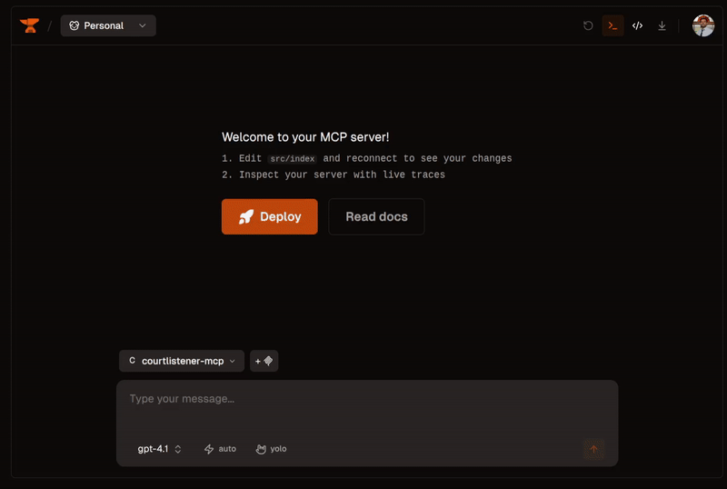

# CourtListener Legal Research MCP Server

A Model Context Protocol (MCP) server providing AI agents instant access to legal research across **3,352 U.S. courts** via CourtListener API.

**Disclaimer:** This is an independent personal project and is not affiliated with, endorsed by, or sponsored by CourtListener or the Free Law Project.



**Built using the [CourtListener API](https://www.courtlistener.com/)** - An open legal database democratizing access to court data with exceptional API documentation and comprehensive coverage of the U.S. legal system.

## Quick Start

```bash
# Install and setup
npm install
echo 'COURTLISTENER_API_KEY="your_api_key"' > .env
npm run generate-courts

# Build and run
npm run build
npm run dev
```

Get your free API key from: https://www.courtlistener.com/api/

> 💡 **About the CourtListener API**: A non-profit legal database providing free access to millions of legal documents, court opinions, and PACER data. The API's excellent documentation and comprehensive data coverage make legal research accessible to everyone.

## Available Tools

### **Core Legal Research Tools**
*Accesses CourtListener's opinion database - all 3,352 courts*

#### 🔍 search_cases_by_problem
Find relevant cases using natural language legal problems
- **Parameters**: `search_keywords[]`, `jurisdiction`, `case_type`, `date_range`, `limit`

#### 📋 get_case_details
Deep dive into specific cases with full opinion text
- **Parameters**: `case_id`, `include_full_text`

#### 🔗 find_similar_precedents
Discover cases with similar legal reasoning
- **Parameters**: `reference_case_id`, `jurisdiction`, `legal_concepts`, `limit`

#### 📊 analyze_case_outcomes
Analyze outcome patterns for success prediction
- **Parameters**: `case_type`, `jurisdiction`, `court_level`, `date_range`

#### ⚖️ get_judge_analysis
Understand judge's ruling patterns for strategy
- **Parameters**: `judge_name`, `case_type`, `court`, `jurisdiction`

#### ✅ validate_citations
Verify and expand legal citations
- **Parameters**: `citations[]`, `context_text`, `jurisdiction`

#### 📝 get_procedural_requirements
Find filing requirements and court rules
- **Parameters**: `case_type`, `jurisdiction`, `court`, `claim_amount`

#### 📈 track_legal_trends
Identify trends in case law
- **Parameters**: `legal_area`, `time_period`, `trend_type`

### **RECAP Archive Integration** 🔒
*Federal PACER data accessed via CourtListener's RECAP Archive*

> **Premium Access**: Some functions require a CourtListener premium subscription
> - 🔒 **PREMIUM REQUIRED** | 📊 **BASIC ACCESS**

#### 📊 search_pacer_dockets (Basic)
Search federal court dockets from PACER
- **Parameters**: `case_name`, `court`, `date_range`, `party_name`, `nature_of_suit`

#### 📊 search_parties_attorneys (Basic)
Track attorney representation patterns
- **Parameters**: `party_name`, `attorney_name`, `firm_name`, `court`, `date_range`

#### 📊 track_case_status (Basic)
Monitor case status and recent activity
- **Parameters**: `docket_id`, `include_recent_activity`, `status_history`

#### 🔒 get_docket_entries (Premium)
Detailed timeline of case filings and orders
- **Parameters**: `docket_id`, `entry_type`, `limit`

#### 🔒 analyze_case_timeline (Premium)
Deep case progression analysis with activity patterns
- **Parameters**: `docket_id`, `analysis_type`, `include_documents`

#### 🔒 get_case_documents (Premium)
Access documents with full text extraction
- **Parameters**: `docket_id`, `document_type`, `include_text`, `limit`

## Available Resources

Browse via MCP client:
- `courtlistener://courts/all` - All 3,352 courts
- `courtlistener://courts/federal` - Federal courts
- `courtlistener://courts/state` - State courts
- `courtlistener://courts/states/{state}` - State-specific courts
- `courtlistener://jurisdictions/court-mappings` - Jurisdiction mappings

## Jurisdiction Options

| Input | Description | Example |
|-------|-------------|---------|
| `"all"` | All courts | Search nationwide |
| `"federal"` | Federal courts | Circuit, District courts |
| `"california"` | State courts | All CA courts |
| `"scotus"` | Specific court | Supreme Court |
| `"ca9,nysd"` | Multiple courts | 9th Circuit + NY Southern |

## MCP Client Setup

Add to Claude Desktop or MCP client:

```json
{
  "mcpServers": {
    "courtlistener": {
      "command": "node",
      "args": ["/path/to/courtlistener-mcp/.smithery/index.ts"],
      "env": {
        "COURTLISTENER_API_KEY": "your_api_key"
      }
    }
  }
}
```

## Usage Examples

### Case Research Workflow
```javascript
// 1. Search for cases
{
  "tool": "search_cases_by_problem",
  "arguments": {
    "search_keywords": ["breach of warranty", "defective product"],
    "jurisdiction": "california",
    "case_type": "warranty"
  }
}

// 2. Get case details
{
  "tool": "get_case_details",
  "arguments": {
    "case_id": "12345",
    "include_full_text": false
  }
}

// 3. Find similar cases
{
  "tool": "find_similar_precedents",
  "arguments": {
    "reference_case_id": "12345",
    "jurisdiction": "federal"
  }
}
```

### PACER Research (Premium)
```javascript
// Search PACER dockets
{
  "tool": "search_pacer_dockets",
  "arguments": {
    "nature_of_suit": "contract",
    "court": "federal"
  }
}

// Analyze case timeline (Premium)
{
  "tool": "analyze_case_timeline",
  "arguments": {
    "docket_id": "67890",
    "analysis_type": "all"
  }
}
```

## Contributing

We welcome contributions! Please see [CONTRIBUTING.md](CONTRIBUTING.md) for guidelines on how to submit improvements, bug fixes, and new features.

### API Rate Limits
- **Authenticated**: 5,000 requests/hour
- **Unauthenticated**: 100 requests/day

## Premium Access

Basic API access provides all Core Legal Research tools plus limited PACER metadata. Premium access unlocks:
- Detailed docket entry analysis
- Full document text extraction
- Comprehensive timeline analysis
- Advanced litigation intelligence

Get premium access: https://www.courtlistener.com/help/api/rest/

## Acknowledgments

This independent project uses the [CourtListener API](https://www.courtlistener.com/), created by the Free Law Project, a non-profit organization. We acknowledge and appreciate:

- **Their API Design**: Clear, well-documented REST API with comprehensive field coverage
- **Open Legal Data**: Free access to millions of court opinions, dockets, and legal documents
- **RECAP Archive**: Democratizing access to PACER federal court data
- **Community Impact**: Making legal research accessible beyond expensive commercial databases

Consider supporting their mission: [Free Law Project](https://free.law/)

## License

MIT
